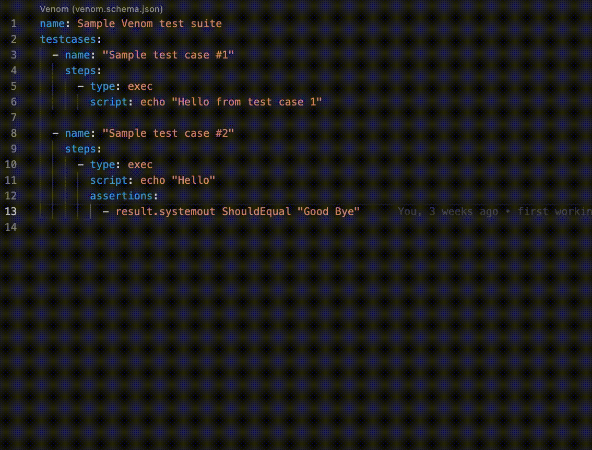
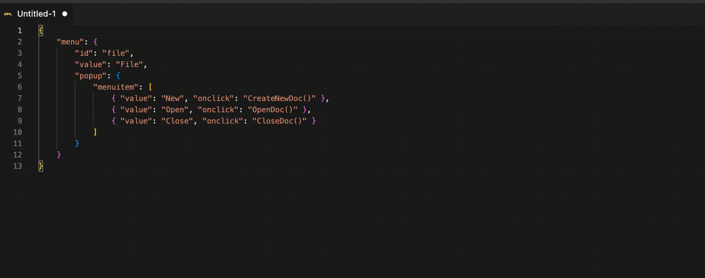

# vscode-venom

[Venom](https://github.com/ovh/venom) integration with Visual Studio Code.

## Features

- Integration with Visual Studio Code's Testing workbench
- JSON/YAML schema for autocompleting and validating the test suites

- Generate assertions from JSON

## Caveats

- Only Venom > 1.0.0 is supported
- Test suites must be named as `*.venom.yml`, otherwise the extension will not be activated
- The JSON schema case is strict, so for example you have to use `bodyFile` instead if `bodyfile` in the `http` executor
